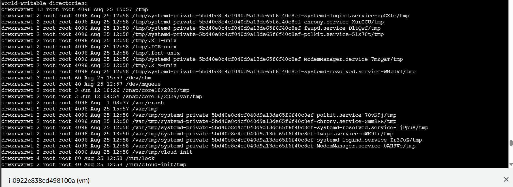
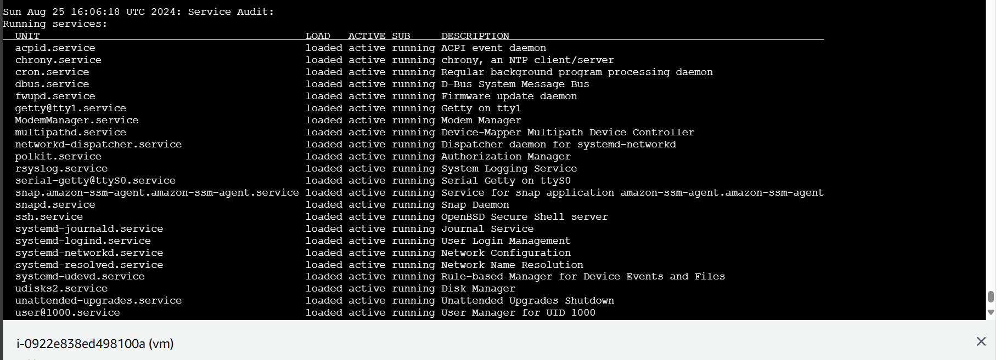

# Security Audit and Hardening Script

---

This script automates security audits and server hardening processes for Linux servers. It performs comprehensive checks, identifies vulnerabilities, and applies hardening measures to improve server security.

## Features

- **User and Group Audits**: List users/groups, check for UID 0 users, and identify users with weak or no passwords.
- **File and Directory Permissions**: Scan for world-writable files/directories and SUID/SGID files.
- **Service Audits**: List running services and check for unnecessary or unauthorized services.
- **Firewall and Network Security**: Verify firewall status, report open ports, and check IP forwarding.
- **IP and Network Configuration Checks**: Identify public vs. private IP addresses.
- **Security Updates and Patching**: Check for available security updates and verify automatic update configurations.
- **Log Monitoring**: Check for suspicious log entries related to SSH.
- **Server Hardening**: Implement SSH key-based authentication, disable IPv6, secure the bootloader, configure the firewall, and set up automatic updates.
- **Custom Security Checks**: Extend the script with custom checks based on specific requirements.
- **Report and Alerting**: Generate a summary report of the audit and hardening process.

## Installation

### Prerequisites

Ensure you have the following packages installed on your Linux server:

1. **Update Package Lists**:
    
    ```bash
    sudo apt update
    
    ```
    
2. **Install Required Packages**:
    
    ```bash
    sudo apt install -y net-tools procps sysstat gawk ufw iptables grub2 unattended-upgrades openssh-client openssh-server
    
    ```
    

### Clone the Repository

1. **Clone the Repository**:
    
    ```bash
    git clone <https://github.com/your-repo/security-audit.git>
    cd security-audit
    
    ```
    

### Set Script Permissions

1. **Make the Script Executable**:
    
    ```bash
    chmod +x security_audit.sh
    
    ```
    

## Configuration

### Custom Security Checks

- **Edit Configuration File**:
    - Open `security_checks.conf` in a text editor.
    - Add any custom security checks based on your organization’s requirements.

## Usage

### Running the Script

To execute the script and perform the security audit and hardening, run:

```bash
./security_audit.sh

```

## Example Output

### File and Directories Permission



### Service Audit



## Troubleshooting

### Permissions Issues

- **Permission Denied**: If you encounter a "Permission Denied" error, ensure the script has execute permissions. Run:
    
    ```bash
    chmod +x security_audit.sh
    
    ```
    
- **Ownership**: Ensure you have the necessary permissions to execute the script. If needed, change ownership:
    
    ```bash
    sudo chown youruser:yourgroup security_audit.sh
    
    ```
    

### Common Errors

- **Missing Packages**: If certain commands are not found, ensure all required packages are installed.
- **Configuration Issues**: Verify that `security_checks.conf` is correctly formatted and contains valid commands.

## Documentation

### Script Details

The script is divided into modular functions for each security aspect, allowing for easy updates and customization:

- **User and Group Audits**
- **File and Directory Permissions**
- **Service Audits**
- **Firewall and Network Security**
- **IP and Network Configuration Checks**
- **Security Updates and Patching**
- **Log Monitoring**
- **Server Hardening**
- **Custom Security Checks**

### Modularity of the Script

The script is designed with modularity in mind, which means it is divided into specific, self-contained sections or functions that each handle a distinct part of the security audit and hardening process. This design approach offers several key benefits:

#### 1. **Ease of Maintenance**
   - Each module (function or section) is responsible for a specific security check or hardening step. This separation of concerns makes it easier to update or modify individual parts of the script without affecting the entire system. For example, if you need to change how the script checks for weak passwords, you can update the relevant module without disrupting other parts of the script.

#### 2. **Reusability**
   - The modular design allows individual functions to be reused in different contexts or scripts. For example, the function that checks for SUID/SGID files could be extracted and used in another script designed for a different security task. This reduces redundancy and ensures consistency across different scripts.

#### 3. **Customization**
   - You can easily extend the script by adding new modules or modifying existing ones to meet specific organizational requirements. For instance, if your organization requires additional checks that are not covered by the default script, you can simply add a new function or modify an existing one to incorporate these custom checks.

#### 4. **Scalability**
   - The modular nature of the script makes it scalable, meaning it can easily be expanded to include more security checks or hardening steps as needed. This is particularly useful as security standards evolve, and new vulnerabilities emerge.

#### 5. **Testing and Debugging**
   - Modules can be tested and debugged independently, which simplifies the process of identifying and fixing issues. If a specific part of the script is not working as expected, you can isolate and test that module without running the entire script.

### Example of Modularity in the Script

The script might include modules like:

- **User and Group Audits Module**: Handles all checks related to users and groups, such as listing users, checking for UID 0 users, and identifying weak passwords.
  
- **File and Directory Permissions Module**: Scans for world-writable files, SUID/SGID bits, and checks the permissions of `.ssh` directories.
  
- **Service Audits Module**: Lists all running services, checks for unauthorized services, and ensures critical services are configured correctly.
  
- **Firewall and Network Security Module**: Verifies firewall status, checks open ports, and reports any insecure network configurations.
  
- **Server Hardening Module**: Applies various hardening measures like configuring SSH, disabling IPv6, securing the bootloader, and setting up automatic updates.

By organizing the script into these modules, you can easily manage and expand the script, ensuring that it remains adaptable and effective as your security needs change.


### Configuration File

- **`security_checks.conf`**: A configuration file for adding custom security checks.

### Log File

- **`security_audit.log`**: The log file where audit results and actions are recorded.

## Contribution

Contributions are welcome! Please submit a pull request with improvements or updates.
